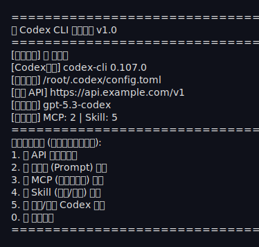
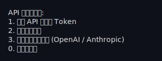
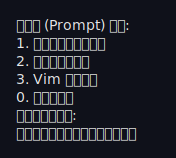
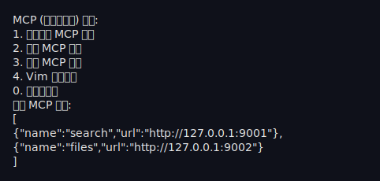

# Codex-C 终端管理脚本说明

`codex-c` 是一个用于管理 Codex 配置的交互式 Bash 脚本，支持面板展示、API/模型管理、Prompt/Skill 目录管理、MCP 配置管理，以及服务重载等操作。

## 功能概览
- 启动面板：显示运行状态、版本、配置路径、当前 API/模型、MCP/Skill 数量
- API 和模型管理：修改 API 地址、Token、模型；支持 OpenAI/Anthropic 预设
- 模型自动发现：从 API 拉取模型列表，优先列出支持 `codex` 的 `gpt` 模型供选择
- API 配置管理：支持保存多个配置并一键切换（新增/切换/修改/删除）
- Prompt 管理：以 `.md` 文件管理提示词（目录：`$CODEX_DIR/prompts`），支持新建/查看/删除/禁用/启用/批量禁用启用
- Skill 管理：以目录管理技能（`$CODEX_DIR/skills/<name>/SKILL.md`），支持新建/查看/删除
- MCP 管理：直接读写 `config.toml` 的 `[mcp_servers.<name>]` 段落，支持新增/查看/修改/删除/禁用/启用/批量禁用启用
- 校验与回滚：修改后自动连通性校验，失败则回滚到 `.bak`
- 迁移辅助：启动时可将旧配置中的 Prompt/Skill 导出到目录（可选）
- 回收站：删除 Prompt/MCP/Skill 会移动到 `$CODEX_DIR/trash`

## 截图





## 依赖
- `bash`
- `jq`：JSON 解析与修改
- `python3`：TOML 解析与修改
- `curl`：API 连通性与模型校验
- `vim`：深度编辑
- （可选）`fzf`：高级交互式菜单（当前默认关闭）

## 安装与全局命令
推荐把脚本加入 PATH：
```bash
sudo ln -s /data/projects/codex-c脚本/codex-c /usr/local/bin/cx
```
然后运行：
```bash
cx
```

## 使用方法
默认读取 `CONFIG_PATH`，可通过环境变量覆盖；脚本会尝试自动扫描常见路径（如 `/root/.codex`、`$HOME/.codex`、`/home/*/.codex`），扫描不到会提示输入 `.codex` 目录。

```bash
CONFIG_PATH=/root/.codex/config.toml cx
```
```bash
CONFIG_PATH=/root/.codex/config.toml codex-c
```

常用环境变量：
- `CONFIG_PATH`：配置文件路径
- `CONFIG_FORMAT`：`auto`/`json`/`toml`
- `AUTH_PATH`：鉴权文件路径（默认 `/root/.codex/auth.json`）
- `CODEX_DIR`：Codex 根目录（默认自动识别 `config` 所在目录）
- `PROMPTS_DIR`：提示词目录（默认 `$CODEX_DIR/prompts`）
- `SKILLS_DIR`：技能目录（默认 `$CODEX_DIR/skills`）
- `MCP_DIR`：保留兼容字段（当前 MCP 直接写入 `config.toml`）
- `MCP_FILE_EXT`：保留兼容字段
- `AUTO_MIGRATE`：启动时是否尝试从旧配置导出到目录（默认 `1`）
- `API_PROFILES_PATH`：多配置存储路径（默认 `$CODEX_DIR/api_profiles.json`）
- `TRASH_DIR`：回收站目录（默认 `$CODEX_DIR/trash`）
- `USE_FZF`：是否启用 `fzf` 菜单（默认 `0`）

## 配置字段约定
JSON 模式默认字段：
- API 地址：`.api.url`
- Token：`.api.token`
- 模型：`.model`
- Prompt：`.prompt`
- MCP：`.mcp`
- Skill：`.skills`

TOML 模式默认字段：
- 模型：`model`
- API：`model_providers.<provider>.base_url`
- Token：`/root/.codex/auth.json` 内的 `OPENAI_API_KEY` 或 `ANTHROPIC_API_KEY`
- MCP：`[mcp_servers.<name>]` 段落（支持 `url + headers` 或 `command + args`）

鉴权与模型拉取说明：
- `auth.json` 中 `auth_mode` 为 `apikey` 时，模型列表请求使用 `x-api-key` 头；否则使用 `Authorization: Bearer`。
- `model_providers.<provider>.requires_openai_auth` 支持 `true/false` 与 `1/0`（大小写不敏感）。

如果你的字段不同，可以在脚本顶部调整 `*_PATH` 或候选字段数组。

## 回滚与安全
- 每次写入前自动备份为 `*.bak`
- 校验失败会自动回滚
- MCP 直接写入 `config.toml`，禁用时会改写为 `[mcp_servers_disabled.<name>]`

## 常见问题
- **提示缺少 jq/python3/curl**：按提示安装即可
- **权限不足**：修改 `/root/.codex` 需要 root 权限
- **校验失败**：确认 API 地址可访问，Token 是否正确
- **MCP 启用/禁用**：启用是 `[mcp_servers.<name>]`，禁用是 `[mcp_servers_disabled.<name>]`
