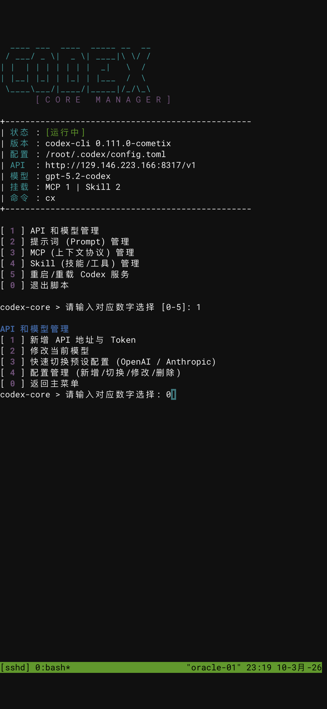

# Codex-Core 终端管理脚本说明

## 简介
`codex-core` 是一个用于管理 Codex 配置的交互式 Bash 脚本，目标是在终端里更快完成 API/模型切换、Prompt/Skill 管理、MCP 配置管理与服务重载。

## 核心功能
- API 与模型管理（新增/切换/修改/删除）
- 模型列表自动拉取并优先显示 `codex` 的 `gpt` 模型
- Prompt/Skill 管理（目录化管理）
- MCP 配置管理（直接读写 `config.toml`）
- 修改后自动校验与回滚

## 功能展示截图


## 安装前提条件
- `bash`
- `jq`（JSON 解析）
- `python3`（TOML 解析）
- `curl`（API 连通性与模型校验）
- `vim`（深度编辑）
- （可选）`fzf`（高级菜单）

## 支持平台
- **Linux / macOS**：原生支持，可直接安装使用
- **Windows**：需要满足以下任一条件
  - 使用 **WSL**（推荐，Ubuntu 等发行版）
  - 使用 **Git Bash / MSYS2**（可运行，但依赖与路径需自行处理）

## 一键安装（推荐）
```bash
curl -fsSL https://raw.githubusercontent.com/JY1003/Codex-core/main/install.sh | bash
```
安装到 `/usr/local/bin`：
```bash
curl -fsSL https://raw.githubusercontent.com/JY1003/Codex-core/main/install.sh | sudo bash
```
说明：
- 脚本会尝试自动安装缺失依赖（需要 root 或 sudo 权限）
- 无法自动安装时会提示缺失项，不影响脚本本体安装
- macOS 下如果通过 `sudo bash` 执行，Homebrew 可能无法自动安装依赖，请先用当前用户安装依赖

## 手动安装
1. 克隆仓库
```bash
git clone https://github.com/JY1003/Codex-core.git
```
2. 进入目录并赋予执行权限
```bash
cd Codex-core
chmod +x codex-core
```
3. 建议加入 PATH
```bash
sudo ln -sf "$(pwd)/codex-core" /usr/local/bin/cx
```
4. 启动
```bash
cx
```
